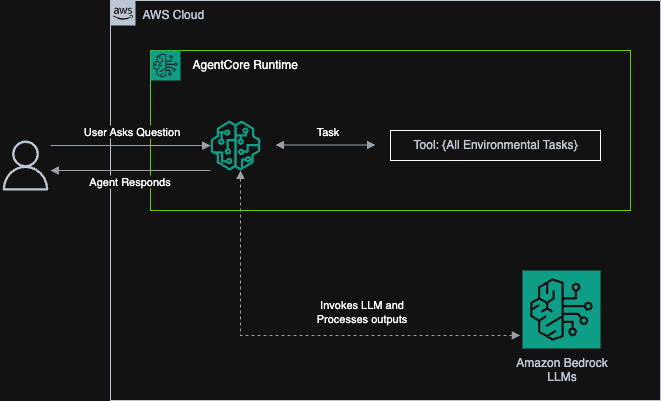

# EcoAgents – Basic Case Study with Amazon Bedrock AgentCore

## 📖 Purpose

This project is designed as a **learning case study**. It follows the AWS HQ workshop (AWS User Group Toronto - August 21, 2025) demonstration done by Jane Shen on Bedrock AgentCore but keeps the scope small and approachable. Instead of general tools like a calculator, it introduces **simple environmental tools** to practice wiring Bedrock models to custom logic.

The focus is on **understanding the flow**: model → agent runtime → tool → response. We've implemented a **dual-agent approach** with Bedrock integration and fallback to keyword matching.

---

## 🏗️ Architecture



_High-level architecture showing the dual-agent approach with Bedrock integration and fallback mechanisms._

---

## 🛠️ Tech Stack

- **Amazon Bedrock** (Claude 3 Haiku)
- **AgentCore Runtime** (agent orchestration)
- **Python (AWS SDK / boto3)**
- **FastAPI** (for local API testing)
- **Mock Data Sources** (simple JSON/cached data)

---

## ✨ Example Tools

1. `get_air_quality(city)` → returns simple AQI values from a mock table
2. `estimate_trip_emissions(origin, destination, mode)` → rough CO₂ estimate using distance × factor
3. `get_wildfire_alerts(region)` → mock wildfire alerts

> All tools are **mocked first**. You can later replace them with real APIs if you want to go deeper.

---

## 🗂️ Project Structure

```
agentops-ecoagents/
  ├─ backend/
  │  ├─ app.py              # FastAPI app with chat endpoints
  │  ├─ agent.py            # Simple keyword-based agent (fallback)
  │  ├─ bedrock_agent.py    # Bedrock-powered agent with LLM integration
  │  ├─ test_agent.py       # Test script for both agents
  │  ├─ tools/
  │  │  ├─ air_quality.py
  │  │  ├─ trip_emissions.py
  │  │  └─ wildfire.py
  │  └─ requirements.txt
  ├─ docs/
  │  ├─ images/
  │  │  └─ architecture.png  # Architecture diagram
  │  ├─ aws-setup.md        # AWS Bedrock configuration guide
  │  └─ workshop-notes.md
  └─ README.md
```

---

## 🔧 Example Tool (Mock)

```python
# backend/tools/air_quality.py
MOCK = {
  "Toronto": {"aqi": 42, "pm25": 7.1},
  "Vancouver": {"aqi": 55, "pm25": 10.2}
}

def get_air_quality(city: str):
    return MOCK.get(city, {"aqi": 50, "pm25": 9.0})
```

---

## 🤖 Agent Runtime (Bedrock Integration)

```python
# backend/bedrock_agent.py
class BedrockEcoAgent:
    def __init__(self, model_id="anthropic.claude-3-haiku-20240307-v1:0"):
        self.bedrock = boto3.client('bedrock-runtime')
        self.model_id = model_id

    def call_bedrock(self, messages: List[Dict[str, str]]) -> str:
        """Call AWS Bedrock with a conversation."""
        body = {
            "anthropic_version": "bedrock-2023-05-31",
            "max_tokens": 1000,
            "temperature": 0.7,
            "system": SYSTEM_PROMPT,
            "messages": messages
        }

        response = self.bedrock.invoke_model(
            modelId=self.model_id,
            body=json.dumps(body)
        )

        response_body = json.loads(response['body'].read())
        return response_body['content'][0]['text'].strip()

    def chat(self, message: str) -> str:
        """Process user message using Bedrock for understanding and tool routing."""
        # Uses Bedrock to determine tool usage, falls back to keyword matching
```

---

## 🔐 AWS Setup

### 1. Enable Bedrock in AWS Console

1. Go to [AWS Bedrock Console](https://console.aws.amazon.com/bedrock/)
2. Click "Get started" or "Enable Bedrock"
3. Accept the terms of service
4. Wait for activation (may take a few minutes)

### 2. Request Model Access

1. In Bedrock console, go to "Model access"
2. Request access to:
   - `anthropic.claude-3-haiku-20240307-v1:0` (recommended for testing)
   - `anthropic.claude-3-sonnet-20240229-v1:0` (for better performance)

### 3. Configure AWS Credentials

```bash
# Option 1: AWS CLI configuration
aws configure

# Option 2: Environment variables
export AWS_ACCESS_KEY_ID=your_access_key
export AWS_SECRET_ACCESS_KEY=your_secret_key
export AWS_DEFAULT_REGION=us-east-1
```

### 4. IAM Permissions

Create an IAM user or role with these permissions:

```json
{
  "Version": "2012-10-17",
  "Statement": [
    {
      "Effect": "Allow",
      "Action": [
        "bedrock:InvokeModel",
        "bedrock:InvokeModelWithResponseStream"
      ],
      "Resource": [
        "arn:aws:bedrock:*::foundation-model/anthropic.claude-3-haiku-20240307-v1:0",
        "arn:aws:bedrock:*::foundation-model/anthropic.claude-3-sonnet-20240229-v1:0"
      ]
    }
  ]
}
```

---

## 🏁 Local Development

### 1. Setup Environment

```bash
cd backend
python -m venv .venv && source .venv/bin/activate
pip install -r requirements.txt
```

### 2. Configure Environment Variables

Create a `.env` file in the backend directory:

```env
AWS_REGION=us-east-1
AWS_ACCESS_KEY_ID=your_access_key
AWS_SECRET_ACCESS_KEY=your_secret_key
BEDROCK_MODEL_ID=anthropic.claude-3-haiku-20240307-v1:0
```

### 3. Start the Server

```bash
uvicorn app:app --reload
```

### 4. Test the API

```bash
# Health check
curl -X GET "http://localhost:8000/health"

# Chat with the agent
curl -X POST "http://localhost:8000/chat" \
  -H "Content-Type: application/json" \
  -d '{"message": "What is the air quality in Toronto?"}'

# List available tools
curl -X GET "http://localhost:8000/tools"
```

### 5. Test Both Agents

```bash
# Test simple agent
python test_agent.py
```
